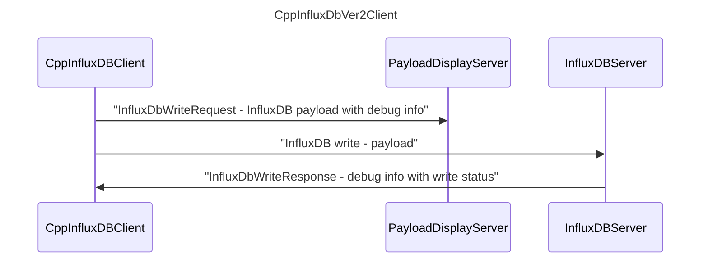

```mermaid

---
title: CppInfluxDbVer2Client
---
sequenceDiagram
    participant client as CppInfluxDBClient
    participant disp as PayloadDisplayServer
    participant db as InfluxDBServer

    client->>disp: "InfluxDbWriteRequest - InfluxDB payload with debug info"
    client->>db: "InfluxDB write - payload"
    db->>client: "InfluxDbWriteResponse - debug info with write status"

```